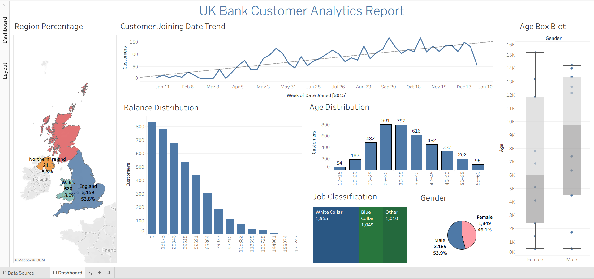

# UK Bank Customer Analytics Report

**Interactive Tableau dashboard analyzing ~4,000 UK bank customers** — exploring geography, demographics, account balances, job classifications, age distributions, and customer joining trends over time.

This is my **first Tableau project** (built in Tableau Desktop/Public), created as a beginner portfolio piece to practice data visualization, dashboard design, and storytelling with customer data.

## ✨ Key Features & Visuals
- **Geographic Distribution**: Filled map of UK regions (England, Scotland, Wales, Northern Ireland) with customer counts and percentages.
- **Customer Growth Trend**: Line chart showing weekly customer joining from 2015, with trend line for overall growth.
- **Balance Distribution**: Histogram of account balances (wide range from low to high).
- **Age Analysis**: Bar chart by age bins + box plot comparing age distributions by gender (outliers, medians).
- **Demographics**: 
  - Gender pie chart (53.9% Male, 46.1% Female)
  - Job classification bar (White Collar, Blue Collar, Other)

## 🛠️ Tools & Data
- **Tool**: Tableau Desktop / Tableau Public
- **Data Source**: Synthetic UK bank customer dataset (~4,004 rows)
  - Key fields: Customer ID, Region, Gender, Age, Balance, Job Classification, Date Joined, etc.
  - File included: `UK-Bank-Customers.csv`
- **File Formats in Repo**:
  - `Dashboard.twb` — Tableau workbook (open in Tableau Desktop/Public)
  - `UK-Bank-Customers.csv` — Raw data
  - `Report.png` — Static screenshot of the dashboard

## 📈 Key Insights (from the data)
- England dominates with **~54%** of customers.
- Customer acquisition grew steadily in 2015 with some seasonal fluctuations.
- Balances are right-skewed — most customers have lower balances, few high-value outliers.
- Age peaks in **25–40** range; slight male majority.
- White Collar jobs are the most common classification.
